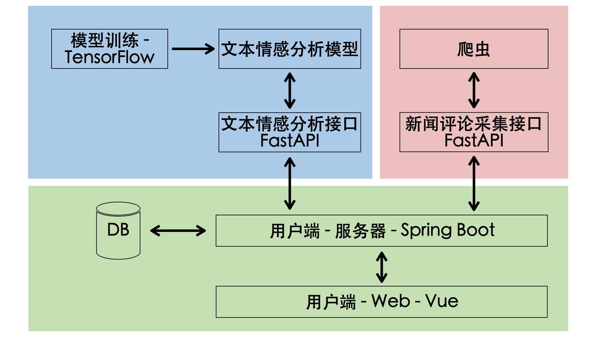
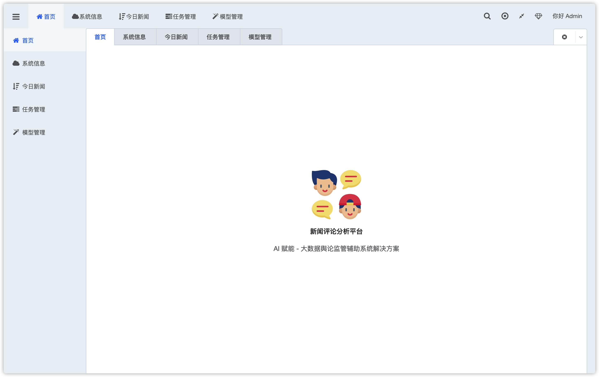
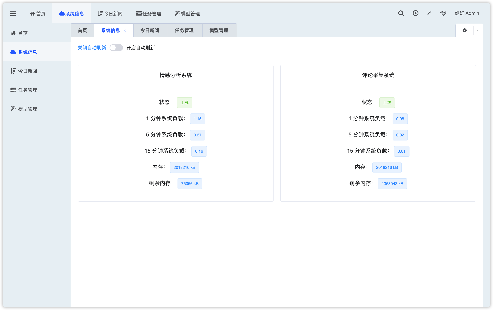
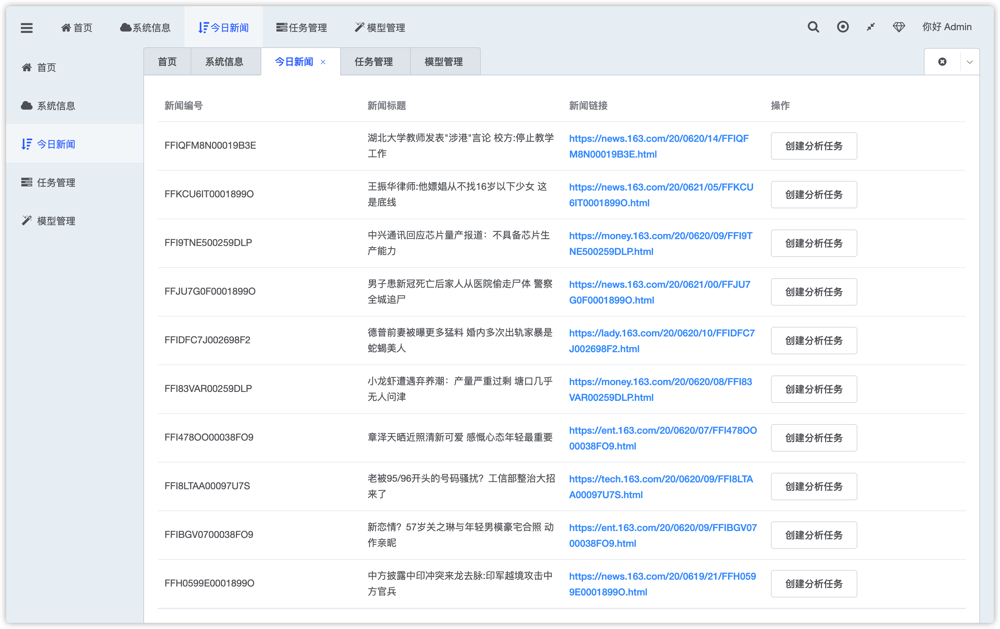
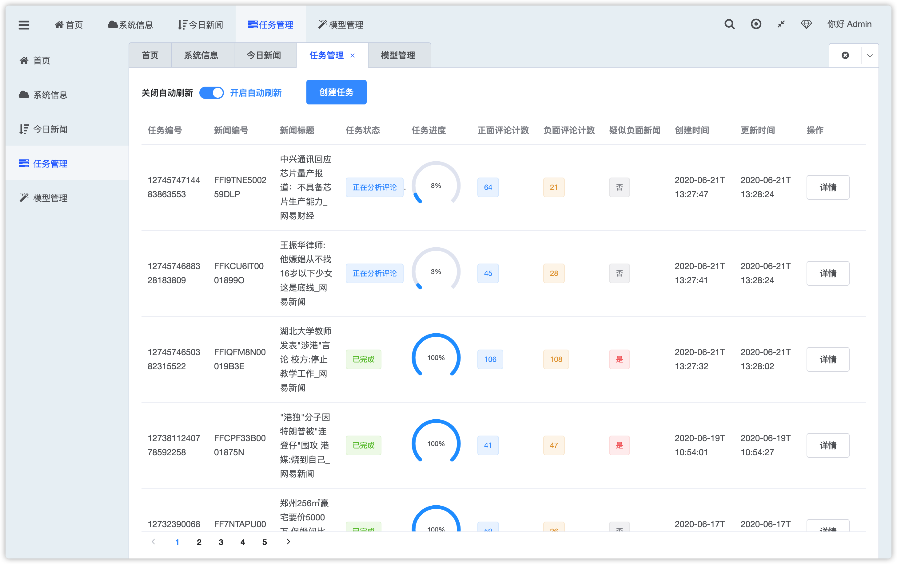
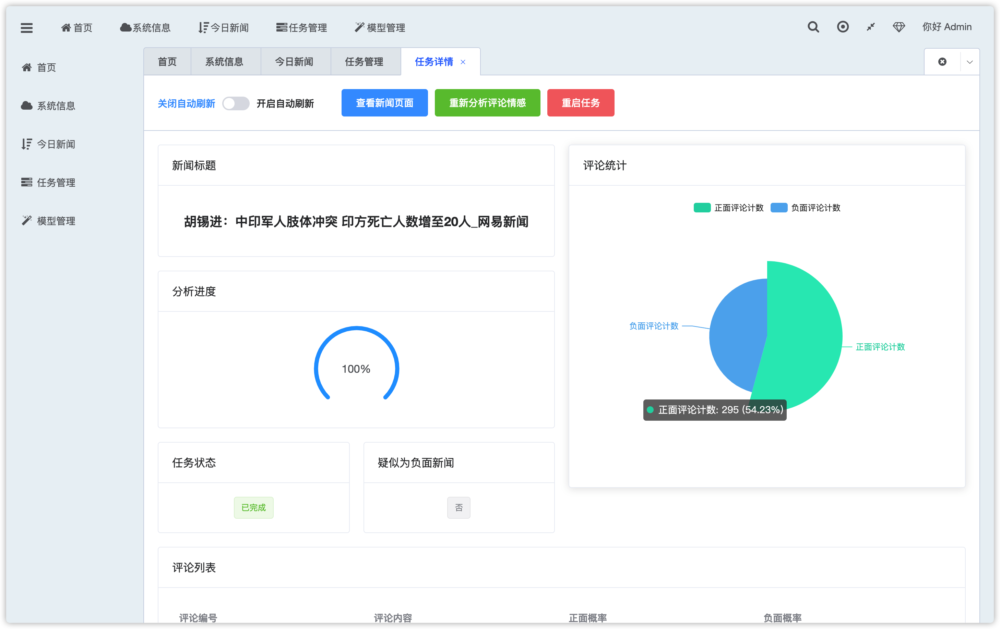
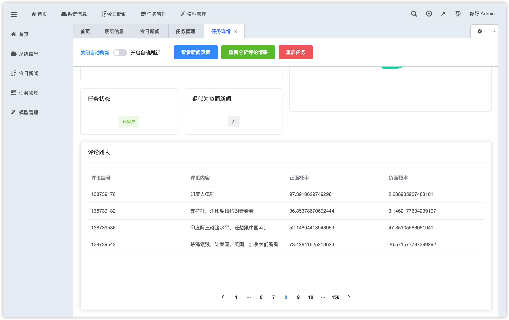
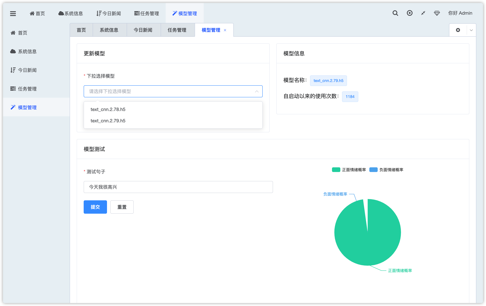

# 新闻评论分析平台 Web 端



## 相关项目

* 新闻评论分析平台 Web 端（当前项目）
* [新闻评论分析平台数据大屏](https://github.com/jerryshell/ncap-datav)
* [新闻评论分析平台服务端](https://github.com/jerryshell/ncap-server)
* [新闻评论分析平台情感分析模块](https://github.com/jerryshell/ncap-model)
* [新闻评论分析平台数据采集模块](https://github.com/jerryshell/ncap-spider)

## 项目初始化

```bash
npm install
```

## 项目运行

```bash
npm run serve
```

## 项目编译

```bash
npm run build
```

## Screenshot

### 首页



### 系统信息



### 今日新闻



### 任务管理



### 任务详情



### 任务详情 - 评论列表



### 模型管理



## 感谢

* [D2Admin](https://github.com/d2-projects/d2-admin)
